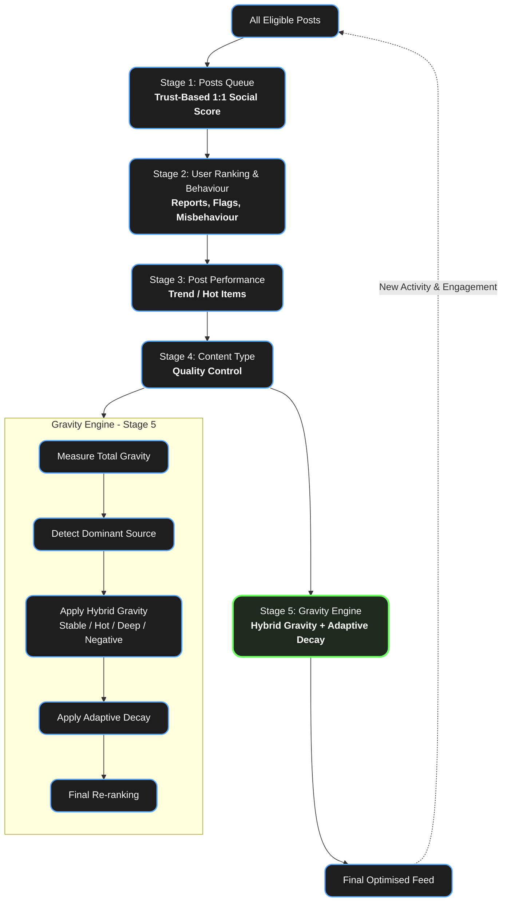

# ORRO Social Media Algorithm – v2.0

## Hybrid Gravity + Decay Model

### Overview

The ORRO News Feed is processed through a 5-stage pipeline.

The first four stages prepare and rank content.

Stage 5 (Gravity Engine) is the final intelligent balancer that applies Hybrid Gravity + Decay to keep the feed optimised, fresh, and healthy over time.

### Full Pipeline

| Stage | Name                           | Purpose                                                               | Key Input                      |
| ----- | ------------------------------ | --------------------------------------------------------------------- | ------------------------------ |
| 1     | Posts Queue (Trust Based)      | Initial ranking using 1:1 Trust Points / Social Score                 | All eligible posts             |
| 2     | User Ranking & Behaviour       | Adjusts ranking based on reports, flags, and user history             | User behaviour data            |
| 3     | Post Performance               | Identifies and boosts Trend / Hot items based on real-time engagement | Likes, comments, shares, winks |
| 4     | Content Type (Quality Control) | Applies quality weighting (originality, relevance, value)             | Content analysis               |
| **5** | **Gravity Engine**             | **Hybrid Gravity + Decay** – final optimisation and balancing         | All previous stages + time     |

## Detailed Explanation of Stage 5: Gravity Engine (Hybrid Gravity + Decay)

The Gravity Engine is the “smart center” of the algorithm. It continuously measures the overall “pull” (gravity) in the current feed and applies two forces:

Gravity → Dynamic relevance momentum (pulls good content forward)
Decay → Time-based fading (prevents old content from dominating)

**How Hybrid Gravity Works**

Gravity is calculated from multiple sources and then differentially applied to the earlier stages:

| Gravity Source             | Type                 | Effect on Previous Stages                       |
| -------------------------- | -------------------- | ----------------------------------------------- |
| High Trust / Social Score  | **Stable Gravity**   | Strongly boosts Stage 1 (Trust Queue)           |
| Strong Post Performance    | **Hot Gravity**      | Temporarily amplifies Stage 3 (Trending items)  |
| High Quality / Originality | **Deep Gravity**     | Strengthens Stage 4 (Quality Control weighting) |
| Negative Behaviour / Flags | **Negative Gravity** | Applies penalty to Stage 2 (User Ranking)       |

### How Decay Works

* Every post has a **decay curve** that increases over time.
* Decay is **adaptive** — the engine automatically adjusts the decay rate based on overall feed health:
  * If the feed feels too quiet → decay slows down (more older content shown)
  * If the feed feels spammy or repetitive → decay speeds up (older content fades faster)

### Gravity Engine Logic (Pseudocode)

```pseudocode
function GravityEngine(currentFeed):
    # 1. Measure current state
    totalGravity = calculateOverallGravity(currentFeed)
    dominantSource = detectDominantGravitySource(totalGravity)
    feedHealth = assessFeedHealth(currentFeed)   # quiet / balanced / spammy

    # 2. Apply Hybrid Gravity (differential effect)
    if dominantSource == "Stable":
        boostStage1(currentFeed)                 # Trust Queue
    elseif dominantSource == "Hot":
        amplifyStage3(currentFeed)               # Trending items (short boost)
    elseif dominantSource == "Deep":
        strengthenStage4(currentFeed)            # Quality weighting
    elseif dominantSource == "Negative":
        penaliseStage2(currentFeed)              # User ranking penalty

    # 3. Apply Adaptive Decay
    decayRate = calculateAdaptiveDecayRate(feedHealth)
    applyTimeDecayToAllPosts(currentFeed, decayRate)

    # 4. Final re-ranking
    return sortFeedByFinalScore(currentFeed)
```

## Full Updated Algorithm Summary (v2.0)

1. Posts Queue – Start with trust-based 1:1 scoring
2. User Ranking & Behaviour – Adjust for reports/flags/misbehaviour
3. Post Performance – Identify Trend/Hot items
4. Content Type – Quality Control weighting
5. Gravity Engine – Apply Hybrid Gravity + Adaptive Decay for final optimisation

**Key Benefits of this Hybrid Model:**

- Prevents echo chambers (Negative Gravity + Decay)
- Rewards consistent high-quality creators (Stable + Deep Gravity)
- Keeps the feed fresh and dynamic (Adaptive Decay)
- Respects the 24h max / 48-72h min rhythm rule you set for fragments
- Scalable for both Beta and Alpha phases

### Visual Flowchart




