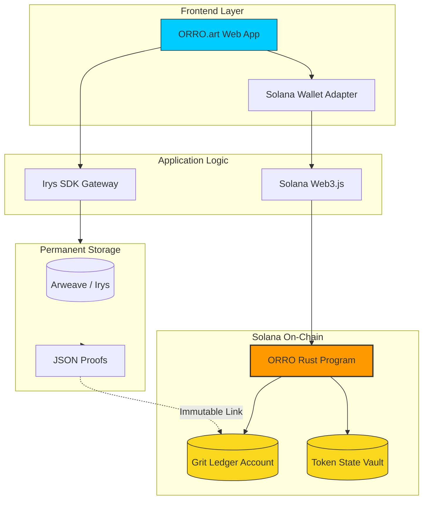

```mermaid
graph TD
    %% Layers
    subgraph Frontend [Frontend Layer]
        UI[ORRO.art Web App]
        Wallet[Solana Wallet Adapter]
    end

    subgraph Logic [Application Logic]
        SDK[Solana Web3.js]
        Irys[Irys SDK Gateway]
    end

    subgraph Blockchain [Solana On-Chain]
        Program[ORRO Rust Program]
        Ledger[(Grit Ledger Account)]
        Tokens[(Token State Vault)]
    end

    subgraph Storage [Permanent Storage]
        Arweave[(Arweave / Irys)]
        Metadata[JSON Proofs]
    end

    %% Connections
    UI --> Wallet
    Wallet --> SDK
    SDK --> Program
    Program --> Ledger
    Program --> Tokens
    
    UI --> Irys
    Irys --> Storage
    Storage --> Metadata
    Metadata -.->|Immutable Link| Ledger

    %% Standard Styling (GitHub Compatible)
    style Program fill:#ff9900,stroke:#333,stroke-width:2px
    style UI fill:#00ccff,stroke:#333
    style Ledger fill:#f9d71c,stroke:#333
    style Tokens fill:#f9d71c,stroke:#333
```
