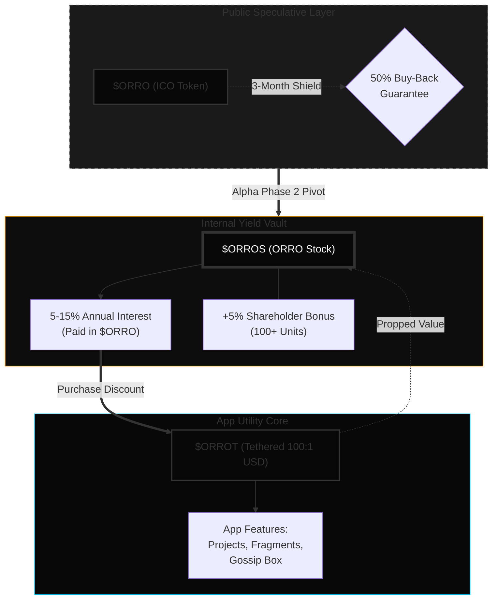

```mermaid
graph TD
    %% Outer Speculative Layer
    subgraph Public_Market [Public Speculative Layer]
        ORRO["$ORRO (ICO Token)"]
        BuyBack{"50% Buy-Back<br/>Guarantee"}
        ORRO -.->|3-Month Shield| BuyBack
    end

    %% The Pivot Mechanism
    Public_Market ==>|Alpha Phase 2 Pivot| Equity_Layer

    %% Internal Equity Layer
    subgraph Equity_Layer [Internal Yield Vault]
        ORROS["$ORROS (ORRO Stock)"]
        Yield["5-15% Annual Interest<br/>(Paid in $ORRO)"]
        Bonus["+5% Shareholder Bonus<br/>(100+ Units)"]
        
        ORROS --> Yield
        ORROS --- Bonus
    end

    %% The Utility Core
    subgraph Utility_Core [App Utility Core]
        ORROT["$ORROT (Tethered 100:1 USD)"]
        App["App Features:<br/>Projects, Fragments,<br/>Gossip Box"]
        
        ORROT --> App
    end

    %% The Winning Gambit Loops
    Yield ==>|Purchase Discount| ORROT
    ORROT -.->|Propped Value| ORROS
    
    %% Styling
    style ORRO fill:#080808,stroke:#333,stroke-width:2px
    style ORROS fill:#080808,stroke:#333,stroke-width:4px,color:#fff
    style ORROT fill:#080808,stroke:#333,stroke-width:2px
    style Public_Market fill:#1a1a1a,stroke:#444,stroke-dasharray: 5 5
    style Equity_Layer fill:#0d0d0d,stroke:#ff9900
    style Utility_Core fill:#080808,stroke:#00ccff
```
