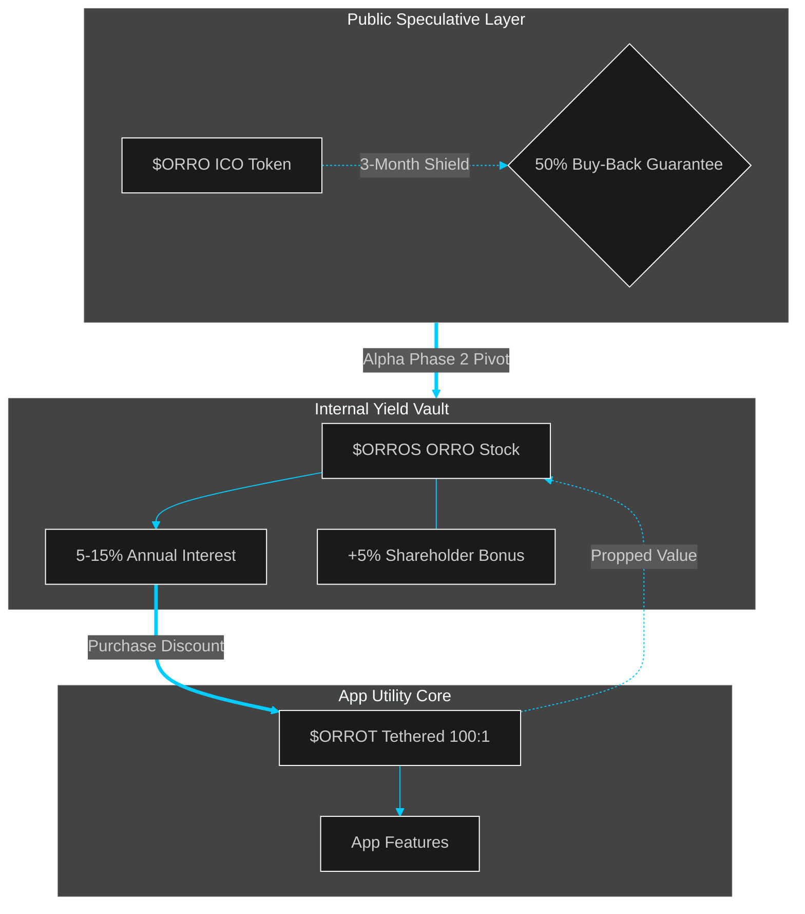

```mermaid
%%{init: {
  'theme': 'dark',
  'themeVariables': {
    'darkMode': true,
    'primaryColor': '#ff9900',
    'primaryTextColor': '#ffffff',
    'lineColor': '#00ccff',
    'mainBkg': '#1a1a1a',
    'nodeBorder': '#ffffff'
  }
} }%%
graph TD
    subgraph Public_Market [Public Speculative Layer]
        ORRO["$ORRO ICO Token"]
        BuyBack{"50% Buy-Back Guarantee"}
        ORRO -.->|3-Month Shield| BuyBack
    end

    Public_Market ==>|Alpha Phase 2 Pivot| Equity_Layer

    subgraph Equity_Layer [Internal Yield Vault]
        ORROS["$ORROS ORRO Stock"]
        Yield["5-15% Annual Interest"]
        Bonus["+5% Shareholder Bonus"]
        
        ORROS --> Yield
        ORROS --- Bonus
    end

    subgraph Utility_Core [App Utility Core]
        ORROT["$ORROT Tethered 100:1"]
        App["App Features"]
        
        ORROT --> App
    end

    Yield ==>|Purchase Discount| ORROT
    ORROT -.->|Propped Value| ORROS
```
