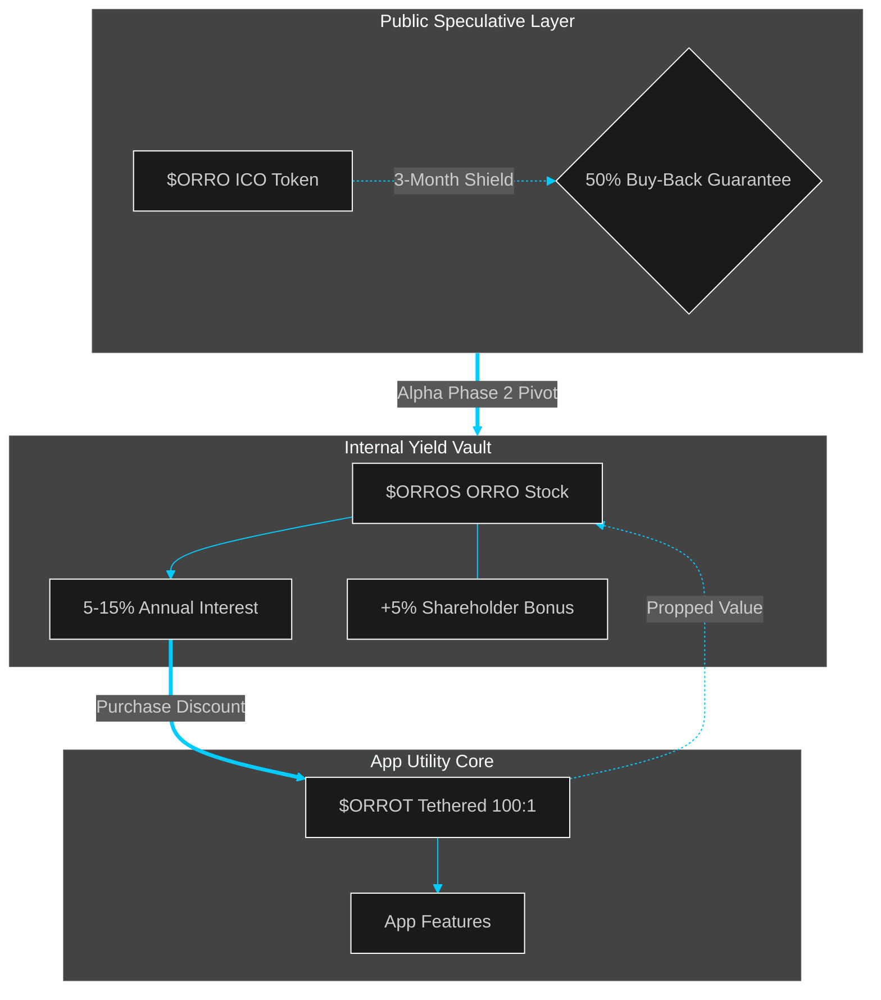

# ORRO Triple-Token Flywheel

The ORRO ecosystem utilizes a phased transition to move from a standard ICO model to a stable, utility-driven economy. This ensures investor protection, prevents market dumping, and incentivizes long-term equity holding.

## 1. Phase 1: The \$ORRO ICO & Safety Net

* **Asset:** **\$ORRO** (The speculative entry token).

* **The Launch:** \$ORRO is listed on public exchanges to allow for price discovery and initial capital inflow.

* **The Investor "Safety Net":** During Alpha Phase 1 & 2, ORRO implements a **3-Month Buy-Back Scheme**.
  
  * **Terms:** The protocol guarantees to buy back **50%** of an initial investor's purchase at the **original ICO price**.
  
  * **Purpose:** To eliminate "downside fear" and ensure early supporters are protected during the initial market volatility.

## 2. Phase 2: The \$ORROT Utility Pivot (Tethered Economy)

Immediately following the Alpha phases, 25% of the liquid supply (200 Million tokens) transitions into **\$ORROT**.

* **Asset:** **\$ORROT** (The Utility Tether).

* **Ratio:** Tethered at **100:1 USD** (\$0.01 per token).

* **Non-Speculative:** \$ORROT cannot be transferred out of the ecosystem or traded on external exchanges. Its supply is **Elastic**: it only expands when users purchase it for app utility (fees, minting, etc.).

* **Market Size:** Fluctuates based on real usage (\$100 to \$1,000,000+), ensuring the "Utility Market" is backed by actual demand, not hype.

## 3. Phase 3: The \$ORROS Equity Layer (The Yield Engine)

Post-Alpha Phase 2, investors can swap their \$ORRO for **\$ORROS** (ORRO Stock).

* **Asset:** **\$ORROS** (Internal Equity Shares).

* **Transfer Restriction:** Like \$ORROT, these are **locked to the user’s wallet** until the end of the share offer to prevent "dumping" and external manipulation.

* **The Yield (Interest):**
  
  * **Base Yield:** 5-10% per annum, paid in \$ORRO.
  
  * **Shareholder Bonus:** Holdings of **100 units or more** trigger an additional **+5% bonus**, totaling up to 15% annual yield.

* **The Arbitrage/ROI Loop:** Users can use their high-yield \$ORROS interest to purchase \$ORROT at a tiered discount*:
  
  * **100 Units:** 5% Discount
  
  * **1,000 Units:** 10% Discount
  
  * **10,000 Units:** 15% Discount
  
  * **100,000 Units:** 20% Discount

**Limited offer subject to change at any time*

## 4. The "Winning Gambit" Summary

This model creates a self-sustaining loop:

1. **\$ORRO** provides the initial spark and liquidity.

2. **\$ORROS** captures the value, locking users into a high-yield "loyalty" model that cannot be dumped on an exchange.

3. **\$ORROT** ensures the app remains usable and affordable, regardless of what the speculative \$ORRO price is doing.

4. **The Discount Loop** encourages \$ORROS holders to become the primary "fuel" for the \$ORROT utility market, driving up the internal enterprise value.
